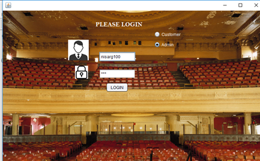
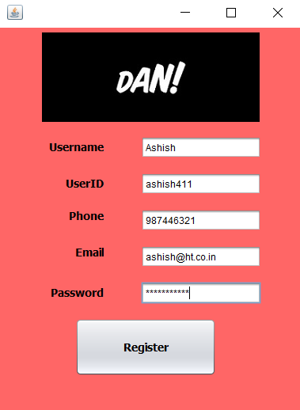
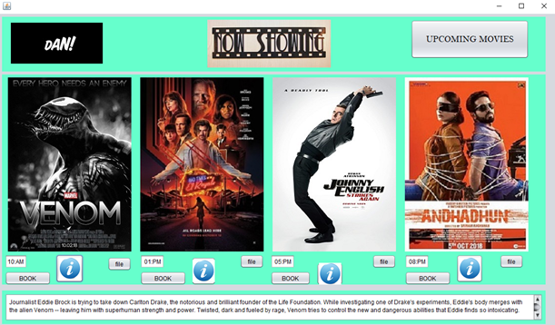
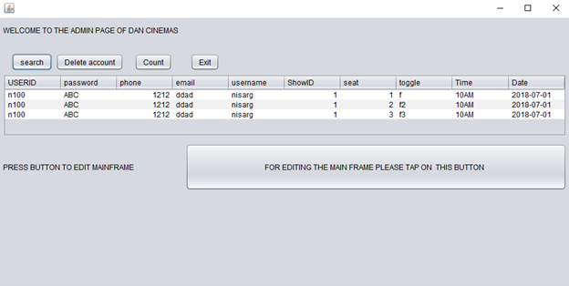
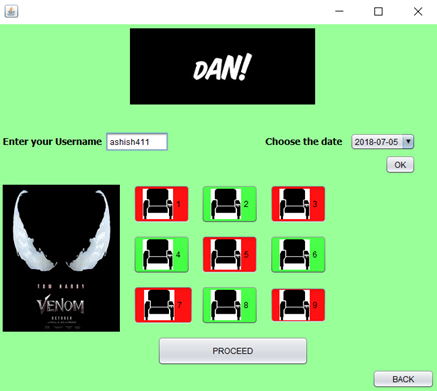
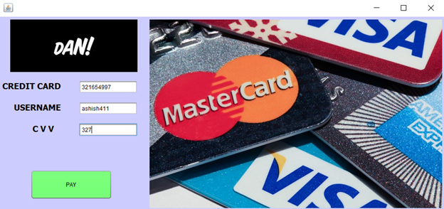

# 🎟️ Theatre Booking System

---

## 🖼️ Application Screenshots

### Login Page


### Register Page


### Home Page


### Admin Panel


### Seat Selection


### Payments Portal


---

The Theatre Booking System is a robust, desktop-based Java application that enables users to book movie tickets, manage shows, and perform administrative tasks. Designed for educational and real-world use, it demonstrates the complete Software Development Life Cycle (SDLC) from requirements to deployment.


## 📌 Features (In-Depth)

- 🎫 **User Registration & Login**: Secure authentication for both customers and administrators. Passwords are stored securely (hashing recommended in production). Role-based access ensures only admins can manage movies and users.
- 🗓️ **Showtime Management**: Users can browse available movies, view detailed showtimes, and see seat availability in real-time. Shows are filterable by date, time, and movie.
- 🎥 **Movie Information**: Each movie includes metadata such as title, genre, duration, synopsis, and upcoming releases. Images/posters can be displayed for a richer UI.
- 🧾 **Admin Dashboard**: Administrators can add, update, or remove movies and showtimes, view all bookings, manage users, and generate reports. All actions are reflected instantly in the UI.
- 💳 **Payment Simulation**: Customers can simulate payments using dummy credit card information. The system validates card number format and CVV before confirming bookings. No real transactions are processed.
- 🎛️ **Intuitive UI/UX**: All controls provide real-time feedback (e.g., seat selection, invalid login, booking confirmation). Form validation prevents incomplete or incorrect submissions.
- 🔒 **Security**: Role-based access, input validation, and SQL injection prevention are implemented. Sensitive data is never logged or displayed.
- 📝 **Booking History**: Customers can view their past and upcoming bookings, print tickets, and cancel bookings (if allowed by policy).

---

## ⚙️ Technologies Used

| Category  | Technology           | Description                                        |
|-----------|----------------------|----------------------------------------------------|
| Frontend  | Java Swing (JFrame)  | Desktop GUI framework for interactive interfaces    |
| Backend   | Java (JDK 8+)        | Application logic                                  |
| Database  | MySQL                | Persistent storage for users, bookings, and movies  |
| Connector | JDBC (MySQL driver)  | Java-MySQL connectivity                            |
| Build     | Apache Ant (optional)| Project build and deployment                       |

---

## 🛠️ Modules (Expanded)

### 1. **Login/Register System**
- **Role Selection**: User selects either Customer or Admin at login.
- **Admin Functions**: Manage users (add, delete, update), manage movies and showtimes, view system logs.
- **Customer Functions**: Register, login, and access booking features.
- **Security**: Passwords are validated and stored securely (hashing recommended).

### 2. **Booking Module**
- **Movie Selection**: Browse or search movies by name, genre, or date.
- **Showtime & Seat Selection**: Choose showtime, view seat map, select available seats (real-time updates).
- **Booking Confirmation**: Review booking summary before payment.
- **Database Integration**: All bookings are stored in MySQL with proper relational mapping.

### 3. **Admin Panel**
- **User Management**: View, add, update, or delete customer/admin accounts.
- **Movie & Show Management**: CRUD operations for movies and showtimes.
- **Booking Reports**: Export booking data, view analytics (e.g., occupancy rates, revenue simulation).
- **Table Refresh**: All tables can be refreshed without restarting the app.

### 4. **Payment Simulation**
- **Validation**: Accepts only valid card number formats and CVV.
- **Confirmation**: Shows booking summary and success message upon simulated payment.
- **Exit**: Optionally exits the payment window or returns to main menu on success.

---

## 🧪 Feasibility Study (TELOS)

- **Technology**: Java and MySQL are well-supported, cross-platform, and scalable for this use case.
- **Economic**: No licensing fees; all tools are open-source or free.
- **Legal**: No use of proprietary or restricted libraries; compliant with educational use.
- **Operational**: Designed for ease of use, reliability, and maintainability. Minimal training required.
- **Schedule**: Can be developed and deployed within a standard academic term (8–12 weeks).

---

## 🔁 SDLC Overview (Detailed)

1. **Requirement Analysis**: Gather requirements from users (students, faculty, theater staff). Define user stories for both customers and admins.
2. **System Design**:
   - **ER Diagrams**: Visualize relationships between users, bookings, movies, and payments.
   - **GUI Mockups**: Design intuitive screens for all user flows.
   - **Database Schema**: Normalize tables, define primary/foreign keys.
3. **Development**:
   - **Frontend**: Build Swing-based forms and dialogs for each module.
   - **Backend**: Implement business logic, database connectivity, and error handling.
4. **Testing**:
   - **Unit Testing**: Test individual modules (login, booking, payment).
   - **Integration Testing**: Ensure modules work together (e.g., booking updates seat availability).
   - **User Acceptance Testing**: Validate with real users for usability and correctness.
5. **Deployment**:
   - **Build**: Use Ant or IDE build tools to package the application.
   - **Database Setup**: Provide SQL scripts for schema creation and sample data.
6. **Maintenance**:
   - **Bug Fixes**: Track and resolve issues.
   - **Enhancements**: Modular codebase allows easy addition of new features.

---

## 🧱 Database Schema (Detailed)

### Tables & Relationships

- **signin** (`userID` PK, `password`, `phone`, `email`, `username`, `role`)
  - Stores user credentials and contact info. `role` distinguishes admin/customer.
- **movies** (`movieID` PK, `title`, `genre`, `duration`, `synopsis`, `releaseDate`)
  - Contains all movie metadata.
- **showtimes** (`showID` PK, `movieID` FK, `showDate`, `showTime`)
  - Maps movies to available showtimes.
- **seats_booked** (`bookingID` PK, `userID` FK, `seatRow`, `seatCol`, `seatName`, `time`, `date`, `showID` FK)
  - Tracks which seats are booked for each show.
- **payment** (`paymentID` PK, `username` FK, `cardNumber`, `cvv`, `bookingID` FK)
  - Stores payment info for each booking (simulation only).

> All tables have proper primary and foreign key constraints to ensure data integrity. Indexes are used for fast lookups.

### Example ER Diagram

```
signin (1) ──────< (M) seats_booked (M) >────── (1) showtimes (M) >────── (1) movies
        \                                 /
         >────── (M) payment
```

---

## 🖥️ Sample Controls (UI Mapping)

| Control          | Variable Name | Description                              |
|------------------|--------------|------------------------------------------|
| Username (Field) | `ui`         | Text field for entering username         |
| Password (Field) | `pa`         | Password field for entering password     |
| Login (Button)   | `login`      | Button to trigger authentication         |
| Customer (Radio) | `cu`         | Radio button for customer role           |
| Admin (Radio)    | `ad`         | Radio button for admin role              |
| Register (Link)  | `register`   | Link/button to open registration dialog  |
| Book (Button)    | `book`       | Button to confirm seat selection         |
| Pay (Button)     | `pay`        | Button to simulate payment               |


## 🔄 Example User Flows

### Customer Booking Flow
1. Launch application and select "Customer" role.
2. Register a new account or log in.
3. Browse movies and select a showtime.
4. Choose available seats from the seat map.
5. Confirm booking summary and proceed to payment.
6. Enter dummy card details and complete booking.
7. View booking confirmation and print ticket.

### Admin Management Flow
1. Launch application and select "Admin" role.
2. Log in with admin credentials.
3. Add or update movies and showtimes.
4. View all bookings and customer data.
5. Export reports or analytics as needed.

---

## 🛡️ Security & Best Practices
- All user inputs are validated to prevent SQL injection and data corruption.
- Passwords should be hashed before storage (use SHA-256 or bcrypt in production).
- Sensitive operations (like user management) are restricted to admins.
- Database connections are managed efficiently and closed after use.

---

## ⚡ Error Handling & Troubleshooting
- All errors are caught and displayed as user-friendly messages.
- Common issues (e.g., invalid login, seat double-booking) are handled gracefully.
- Logs are maintained for admin review (optional).

---

## 🚀 Deployment & Maintenance
- Use the provided `build.xml` or IDE tools to build the application.
- Use the included SQL scripts to set up the database schema and sample data.
- Update the JDBC connection string in the source code to match your MySQL setup.
- Modular code allows easy upgrades and feature additions.

